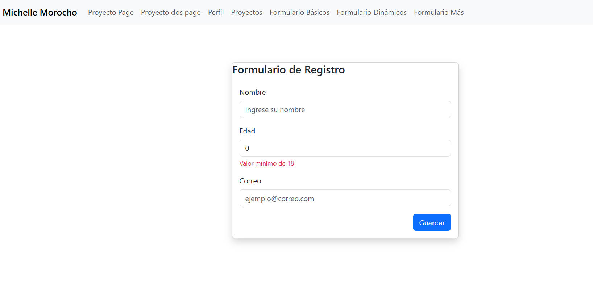
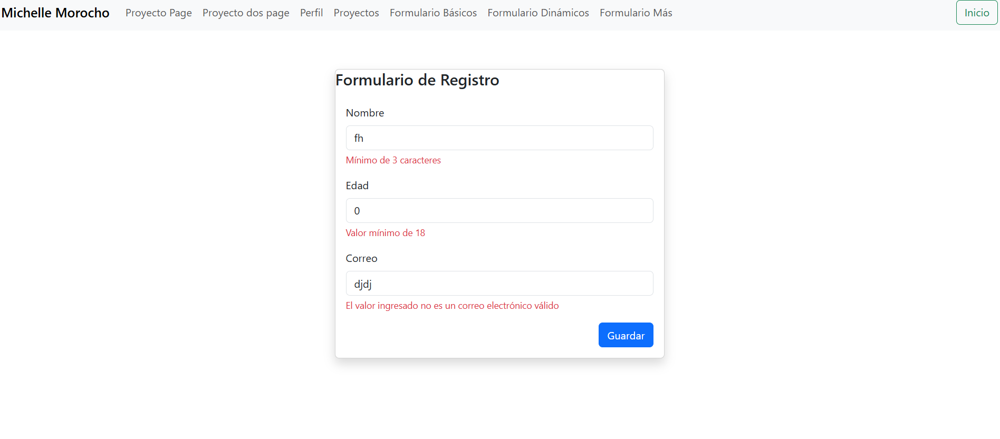
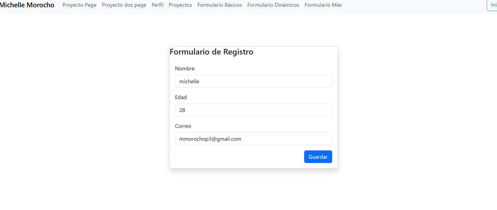
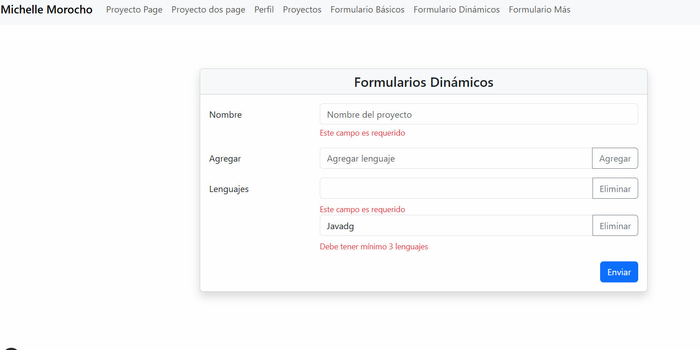
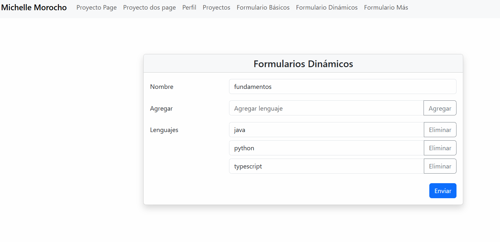
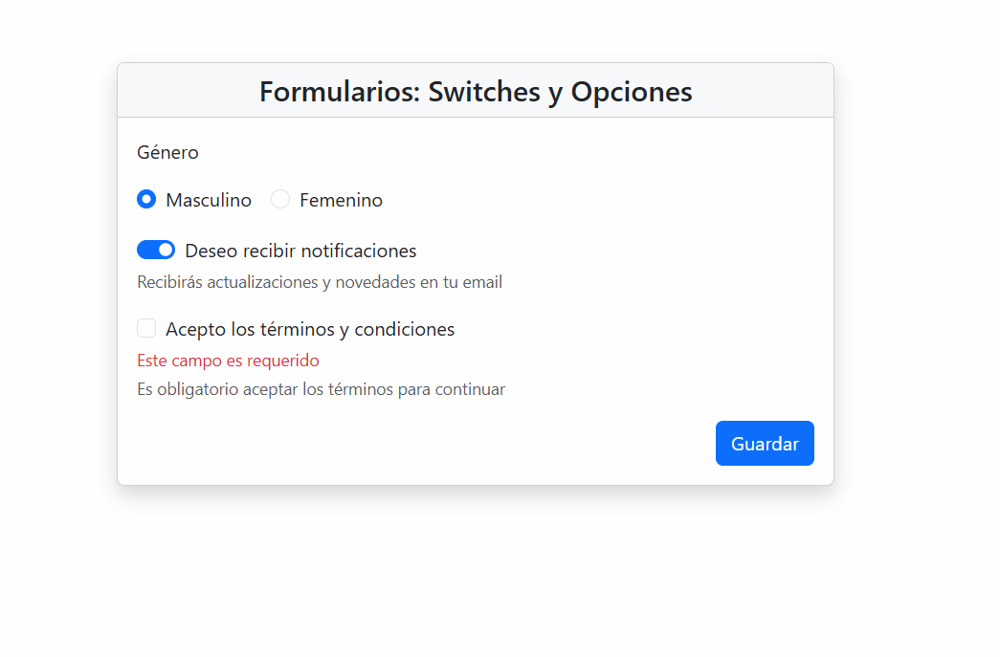
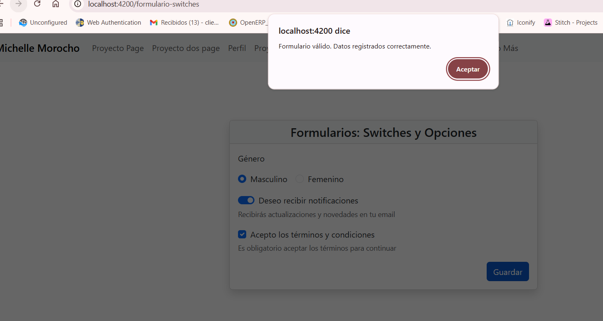

# Programación y Plataformas Web

## Frameworks Web: Angular

<div align="center">
  
</div>

## Práctica 4: Formularios Reactivos en Angular

### Autor

**Pablo Torres**
📧 [ptorresp@ups.edu.ec](mailto:ptorresp@ups.edu.ec)
💻 GitHub: [PabloT18](https://github.com/PabloT18)

---

# Introducción a los Formularios en Angular

Los **formularios reactivos (Reactive Forms)** son una de las herramientas más potentes de Angular para gestionar formularios de manera **estructurada, validada y programática**.
A diferencia de los formularios basados en plantilla (`template-driven forms`), los formularios reactivos se **definen y controlan desde el TypeScript**, ofreciendo mayor control y escalabilidad.

## Características principales

* Creación de formularios complejos con **controles anidados** (`FormGroup`, `FormArray`).
* **Validaciones sincrónicas y asincrónicas** totalmente configurables.
* Respuesta reactiva ante cambios del usuario mediante `valueChanges`.
* Integración sencilla con servicios, APIs o componentes personalizados.
* Mantenimiento y depuración más simples.

---

## Tipos de formularios en Angular

| Característica | Template-driven Forms          | Reactive Forms                            |
| -------------- | ------------------------------ | ----------------------------------------- |
| Definición     | En HTML con `ngModel`          | En TypeScript con `FormBuilder`           |
| Control        | Angular controla el modelo     | El desarrollador controla el modelo       |
| Escalabilidad  | Ideal para formularios simples | Ideal para formularios grandes            |
| Sincronización | Automática (two-way binding)   | Unidireccional y controlada               |
| Validaciones   | En el HTML con atributos       | En TypeScript con funciones de validación |

---

## Clases principales de los formularios reactivos

| Clase           | Descripción                           | Ejemplo                                    |
| --------------- | ------------------------------------- | ------------------------------------------ |
| **FormControl** | Representa un campo individual.       | `nombre = new FormControl('');`            |
| **FormGroup**   | Agrupa varios controles.              | `form = new FormGroup({ nombre, email });` |
| **FormArray**   | Permite listas o conjuntos dinámicos. | `emails = new FormArray([]);`              |

Cada una es **reactiva**, es decir, puede notificar y reaccionar a los cambios en tiempo real.

---

## Validaciones

### Validaciones Sincrónicas

Se ejecutan de inmediato cuando cambia el valor del campo.
Ejemplo:

```typescript
Validators.required
Validators.min(10)
Validators.email
Validators.minLength(3)
```

### Validaciones Asincrónicas

Se ejecutan en segundo plano, por ejemplo, para consultar un API o verificar datos existentes.

```typescript
new FormControl('', [], [this.usuarioDisponible.bind(this)]);
```

### Propiedades útiles de los controles

| Propiedad           | Significado                     |
| ------------------- | ------------------------------- |
| `value`             | Valor actual                    |
| `valid` / `invalid` | Estado de validez               |
| `touched`           | Si el usuario interactuó        |
| `dirty`             | Si el valor fue modificado      |
| `errors`            | Detalle de los errores actuales |

---

## Ventajas de los Formularios Reactivos

1. Control total desde el código TypeScript.
2. Mayor escalabilidad y mantenibilidad.
3. Más fáciles de probar y depurar.
4. Integración sencilla con servicios o APIs.
5. Totalmente compatibles con la detección de cambios `OnPush`.

---

##  Preparación del entorno

Antes de comenzar con las prácticas:

1. Asegúrate de tener **Bootstrap 5** agregado en el `index.html`:

   ```html
   <link
     href="https://cdn.jsdelivr.net/npm/bootstrap@5.3.5/dist/css/bootstrap.min.css"
     rel="stylesheet"
     crossorigin="anonymous"
   />
   ```
2. Importa el **ReactiveFormsModule** en cada componente standalone que lo necesite.

---

##  PRÁCTICA 1: Formularios Básicos

En esta primera práctica se crea un formulario con campos **nombre, edad y correo**, aplicando validaciones básicas y mostrando mensajes de error personalizados.

---


###  Código del componente

```typescript

export class FormulariosBasicosPage {
  private fb = inject(FormBuilder);
  formUtils = FormUtils;

  myForm: FormGroup = this.fb.group({
    nombre: ['', [Validators.required, Validators.minLength(3)]],
    edad: [0, [Validators.required, Validators.min(18)]],
    correo: ['', [Validators.required, Validators.email]],
  });

  onSubmit() {
    if (this.myForm.invalid) {
      this.myForm.markAllAsTouched();
      return;
    }
    console.log(this.myForm.value);
  }
}
```

#### Explicación

#### FormBulder

Angular provee una clase llamada FormBuilder, que simplifica
la creación de formularios reactivos.

```typescript
private fb = inject(FormBuilder);
```

#### FormGroup
Aquí creamos un FormGroup, que representa todo el
formulario.
Cada campo dentro del formulario (nombre, edad, correo)
se declara como un FormControl, junto con sus validadores.

```typescript
myForm: FormGroup = this.fb.group({...})
```
#### Mas funciones

* [formGroup]="myForm" → Vincula el formulario del
HTML con el FormGroup definido en TypeScript.
Todo lo que ocurra en la vista (inputs, validaciones) se
sincroniza automáticamente con la instancia myForm.

* (ngSubmit)="onSubmit()" → Se ejecuta cuando se
envía el formulario (al presionar el botón de tipo
submit).
* autocomplete="off" → Evita que el navegador rellene
automáticamente los campos anteriores.
* El botón con type="submit" es el que activa el evento
(ngSubmit).
* Cualquier otro botón dentro del <form> no ejecutará la


---

### Código del HTML

```html
<form [formGroup]="myForm" (ngSubmit)="onSubmit()">
  <div class="mb-3">
    <label>Nombre</label>
    <input formControlName="nombre" class="form-control" placeholder="Ingrese su nombre">
    @if(formUtils.isValidField(myForm, 'nombre')){
      <span class="form-text text-danger">
        {{ formUtils.getFieldError(myForm, 'nombre') }}
      </span>
    }
  </div>

  <div class="mb-3">
    <label>Edad</label>
    <input formControlName="edad" type="number" class="form-control">
    @if(formUtils.isValidField(myForm, 'edad')){
      <span class="form-text text-danger">
        {{ formUtils.getFieldError(myForm, 'edad') }}
      </span>
    }
  </div>

  <div class="mb-3">
    <label>Correo</label>
    <input formControlName="correo" class="form-control" placeholder="example@mail.com">
    @if(formUtils.isValidField(myForm, 'correo')){
      <span class="form-text text-danger">
        {{ formUtils.getFieldError(myForm, 'correo') }}
      </span>
    }
  </div>

  <button class="btn btn-primary float-end" type="submit">Guardar</button>
</form>
```

---

#### Explicación

* **Input:** Cada `<input>`:  
  * Está enlazado al formulario reactivo con formControlName.
  * Hereda los validadores declarados en TypeScript.
  * Angular gestiona automáticamente si el campo está válido o inválido.

* **Validators:** define las reglas (requerido, mínimo, longitud, formato).
* **@if:** sintaxis moderna en Angular 20+ para mostrar mensajes condicionales.
* **FormUtils:** clase auxiliar que simplifica los mensajes de error.

## Clase auxiliar FormUtils

En proyectos de Angular con múltiples formularios, es común repetir la misma lógica de validación:
verificar si un campo es válido, mostrar los mensajes de error y traducir los tipos de error a textos comprensibles.
Para evitar esta repetición y mantener el código limpio, se recomienda centralizar toda la lógica de validación en una clase utilitaria.


### ¿Por qué crear una clase `FormUtils` separada?

**1️⃣ Reutilización y consistencia:**
Permite que todos los formularios de la aplicación utilicen los mismos mensajes de error y validaciones.
Así, si se necesita modificar el texto de un error o agregar un nuevo tipo, solo se cambia en un único lugar.

**2️⃣ Código más limpio:**
Evita repetir bloques de `if` o `switch` en cada componente.
El HTML se mantiene más legible, ya que basta con usar:

```html
@if(formUtils.isValidField(myForm, 'nombre')) {
  <span>{{ formUtils.getFieldError(myForm, 'nombre') }}</span>
}
```

**3️⃣ Escalabilidad y mantenimiento:**
En aplicaciones grandes, donde se manejan muchos formularios, tener un helper unificado hace más fácil mantener y actualizar las validaciones.

**4️⃣ Control de errores centralizado:**
Si en el futuro se agregan validadores personalizados o asincrónicos, se pueden integrar fácilmente dentro de esta misma clase, sin modificar todos los formularios existentes.

---

### Código base de la clase `FormUtils`

```typescript
import { FormGroup, ValidationErrors } from '@angular/forms';

export class FormUtils {

  static isValidField(form: FormGroup, fieldName: string): boolean | null {
    return (
      !!form.controls[fieldName].errors &&
      form.controls[fieldName].touched
    );
  }

  static getFieldError(form: FormGroup, fieldName: string): string | null {
    if (!form.controls[fieldName]) return null;

    const errors = form.controls[fieldName].errors ?? {};
    return FormUtils.getTextError(errors);
  }

  static getTextError(errors: ValidationErrors): string | null {
    for (const key of Object.keys(errors)) {
      switch (key) {
        case 'required':
          return 'Este campo es requerido';

        case 'minlength':
          return `Mínimo de ${errors['minlength'].requiredLength} caracteres`;

        case 'min':
          return `Valor mínimo de ${errors['min'].min}`;

        case 'email':
          return 'El valor ingresado no es un correo electrónico válido';

        case 'emailTaken':
          return 'El correo ya está siendo utilizado';

        case 'invalidName':
          return 'El nombre no puede ser ocupado';

        case 'pattern':
          if (errors['pattern'].requiredPattern === FormUtils.emailPattern) {
            return 'El formato del correo electrónico es incorrecto';
          }
          return 'Error de patrón (expresión regular)';

        default:
          return 'Error de validación no controlado';
      }
    }
    return null;
  }
}
```

---

###  Beneficios directos en la práctica

| Beneficio          | Descripción                                                      |
| ------------------ | ---------------------------------------------------------------- |
| **Centralización** | Todos los mensajes de error se controlan desde una sola clase.   |
| **Reutilización**  | Se puede usar en cualquier componente importando la clase.       |
| **Escalabilidad**  | Facilita agregar validaciones personalizadas o asincrónicas.     |
| **Legibilidad**    | Simplifica el HTML y el código TypeScript.                       |
| **Mantenimiento**  | Un solo cambio afecta a toda la aplicación de forma consistente. |

---

###  En la plantilla del formulario

El uso de esta clase es simple y uniforme en todas las páginas:

```html
@if (formUtils.isValidField(myForm, 'correo')) {
  <span class="form-text text-danger">
    {{ formUtils.getFieldError(myForm, 'correo') }}
  </span>
}
```

Esto hace que los formularios sean **más expresivos, mantenibles y fáciles de extender** conforme crece el proyecto.


---

Perfecto — continuemos al estilo del material docente, **explicando la práctica 2 paso a paso**, con teoría y razonamiento detrás de cada bloque de código.
Esta sección se integrará directamente después de la práctica 1 en tu documento **04-Formularios.md**.

---

## PRÁCTICA 2: Formularios Dinámicos

En esta práctica aprenderás a crear **formularios que permiten agregar y eliminar campos de manera dinámica**, utilizando la clase `FormArray`.
Este tipo de formularios son ideales cuando no sabemos cuántos valores tendrá el usuario al ingresar (por ejemplo, lista de lenguajes, teléfonos, hobbies, tareas, etc.).


### PASO 1 — Crear el formulario base

En el archivo TypeScript del componente comenzamos con el formulario principal y el campo fijo “nombre”.

```typescript
export class FormulariosDinamicos {
  private fb = inject(FormBuilder);
  formUtils = FormUtils;

  // Formulario principal
  myForm: FormGroup = this.fb.group({
    name: ['', [Validators.required, Validators.minLength(3)]],

    lenguajes: this.fb.array([
      this.fb.control('Python', [Validators.required, Validators.minLength(3)]),
      this.fb.control('Java', [Validators.required, Validators.minLength(3)]),
    ], Validators.minLength(3))
  });
}
```

####  Explicación

* `FormBuilder` simplifica la creación del formulario.
* `FormGroup` agrupa todos los controles del formulario.
* `FormArray` crea un arreglo dinámico de controles — en este caso, lenguajes de programación.
* Cada elemento del array (`'Python'`, `'Java'`) se define con `this.fb.control()` y sus validadores.
* Además, el propio `FormArray` tiene un validador: `Validators.minLength(3)`, que indica que debe contener al menos 3 lenguajes.

---

####  En el HTML

```html
<h2>Formularios: <small>Dinámicos</small></h2>

<form
  autocomplete="off"
  [formGroup]="myForm"
  (ngSubmit)="onSubmit()"
>

  <!-- Nombre -->
  <div class="mb-3 row">
    <label class="col-sm-3 col-form-label">Nombre</label>
    <div class="col-sm-9">
      <input
        class="form-control"
        formControlName="name"
        placeholder="Nombre del proyecto"
      >

      @if(formUtils.isValidField(myForm, 'name')){
        <span class="form-text text-danger">
          {{ formUtils.getFieldError(myForm, 'name') }}
        </span>
      }
    </div>
  </div>
</form>
```

 Hasta este punto el formulario tiene un campo “nombre” y un arreglo inicial con dos lenguajes precargados.

---

###  PASO 2 — Control independiente para agregar nuevos lenguajes
Ahora creamos un nuevo control para capturar el texto de un nuevo lenguaje antes de añadirlo al arreglo.

```typescript
// Control para agregar nuevos lenguajes
newLenguaje: FormControl = this.fb.control('', [Validators.required, Validators.minLength(3)]);
```

#### Explicación

Este `FormControl` es **independiente del formulario principal** (`myForm`).
Sirve únicamente para manejar el valor temporal que el usuario escribe en el campo “Agregar lenguaje”.

Cuando el usuario hace clic en el botón o presiona *Enter*, este valor será insertado en el `FormArray` y luego se vacía el campo.

---

#### En el HTML

```html
<!-- Agregar Lenguaje -->
<div class="mb-3 row">
  <label class="col-sm-3 col-form-label">Agregar</label>
  <div class="col-sm-9">
    <div class="input-group">
      <input
        class="form-control"
        placeholder="Agregar lenguaje"
        [formControl]="newLenguaje"
        (keydown.enter)="onAddToLenguajes(); $event.preventDefault()"
      >

      <button
        class="btn btn-outline-primary"
        type="button"
        (click)="onAddToLenguajes()"
      >
        Agregar
      </button>
    </div>
  </div>
</div>
```

####  Explicación html

* `[formControl]="newLenguaje"` vincula el input al control independiente.
* `(keydown.enter)` ejecuta el método para agregar el nuevo lenguaje.
* `$event.preventDefault()` evita que al presionar *Enter* se dispare el evento `(ngSubmit)` del formulario (es decir, evita que se envíe el formulario antes de tiempo).

---

#### Método que agrega el nuevo lenguaje

```typescript
// Agregar lenguaje dinámicamente
onAddToLenguajes() {
  if (this.newLenguaje.invalid) return;

  this.lenguajes.push(
    this.fb.control(this.newLenguaje.value, Validators.required)
  );

  this.newLenguaje.reset();
}
```

##### Explicación

1. Se verifica si el nuevo campo es válido.
2. Si es correcto, se agrega al arreglo `lenguajes` un nuevo `FormControl`.
3. Luego se limpia el input con `reset()`.

---

#### Getter para acceder al arreglo de lenguajes

```typescript
// Obtener lenguajes como FormArray
get lenguajes(): FormArray {
  return this.myForm.get('lenguajes') as FormArray;
}
```

##### Explicación

Este *getter* facilita acceder al `FormArray` desde el HTML.
Gracias a esto, podemos usar directamente `lenguajes.controls` en el `@for` del template, sin escribir `myForm.get('lenguajes')` cada vez.

---

### PASO 3 — Listado dinámico de lenguajes

Ahora agregamos la sección que muestra la lista actual de lenguajes y permite eliminarlos.

#### En el HTML
```html
<!-- Lista dinámica -->
<div class="mb-3 row">
  <label class="col-sm-3 col-form-label">Lenguajes</label>

  <div class="col-sm-9" formArrayName="lenguajes">

    @for(item of lenguajes.controls; track item; let i = $index) {

      <div class="input-group mb-2">
        <input class="form-control" [formControlName]="i">
        <button
          class="btn btn-outline-danger"
          type="button"
          (click)="onDeleteLenguaje(i)"
        >
          Eliminar
        </button>
      </div>

      @if(formUtils.isValidFieldInArray(lenguajes, i)) {
        <span class="form-text text-danger">
          {{ formUtils.getFieldErrorInArray(lenguajes, i) }}
        </span>
      }
    }

    @if(formUtils.isValidField(myForm, 'lenguajes')){
      <span class="form-text text-danger">Debe tener mínimo 3 lenguajes</span>
    }

  </div>
</div>
```

---

#### Explicación

1. `formArrayName="lenguajes"` indica que los controles internos pertenecen al arreglo.
2. `@for` recorre todos los controles del arreglo (`lenguajes.controls`).
3. `[formControlName]="i"` asocia cada input con su índice dentro del FormArray.
4. `(click)="onDeleteLenguaje(i)"` elimina el elemento correspondiente.
5. `@if(formUtils.isValidFieldInArray(...))` muestra el mensaje de error si ese control específico es inválido.
6. Al final, se muestra un mensaje general si el arreglo tiene menos de 3 elementos válidos.

---

### PASO 4 — Métodos finales

```typescript
// Eliminar lenguaje
onDeleteLenguaje(index: number) {
  this.lenguajes.removeAt(index);
}

// Enviar
onSubmit() {
  this.myForm.markAllAsTouched();
  console.log(this.myForm.value);
}
```

#### Explicación

* **`removeAt(index)`** elimina el elemento en la posición indicada del FormArray.
* **`markAllAsTouched()`** marca todos los campos como “tocados” para forzar la visualización de los errores antes del envío.
* El formulario completo se imprime en consola con `this.myForm.value`.

---

### PASO 5 — Métodos genéricos de `FormUtils` para FormArray

Para manejar los errores de cada control dentro del FormArray, agregamos en la clase `FormUtils` los métodos especializados:

```typescript
static isValidFieldInArray(formArray: FormArray, index: number) {
  return (
    formArray.controls[index].errors && formArray.controls[index].touched
  );
}

static getFieldErrorInArray(formArray: FormArray, index: number): string | null {
  if (formArray.controls.length == 0) return null;

  const errors = formArray.controls[index].errors ?? {};
  return FormUtils.getTextError(errors);
}
```

#### Explicación

* **`isValidFieldInArray()`**:
  Comprueba si un campo dentro del arreglo tiene errores y si el usuario ya interactuó con él.
  Devuelve `true` cuando debe mostrarse el mensaje de error.

* **`getFieldErrorInArray()`**:
  Devuelve el mensaje correspondiente según el tipo de error del control, reutilizando la función `getTextError()` de `FormUtils`.

---

### RESUMEN GENERAL

| Concepto               | Descripción                                                               |
| ---------------------- | ------------------------------------------------------------------------- |
| **FormArray**          | Permite crear listas dinámicas de campos.                                 |
| **newLenguaje**        | Control temporal para capturar valores nuevos.                            |
| **Getter `lenguajes`** | Facilita el acceso al arreglo desde el HTML.                              |
| **@for y @if**         | Nuevas estructuras de control en Angular 17+ (reemplazan *ngFor y *ngIf). |
| **FormUtils**          | Centraliza la validación de cada elemento y simplifica el HTML.           |

---


Perfecto.
Aquí tienes la nueva sección lista para integrarse a tu documento **04-Formularios.md**, justo después de la **Práctica 2: Formularios Dinámicos**, manteniendo el mismo estilo formal, sin emojis y con explicación paso a paso.

---

## PRÁCTICA 3: Formularios con Switches, Checkboxes y Radios

En esta práctica se desarrolla un formulario que utiliza controles booleanos y de selección: interruptores, casillas de verificación y botones de opción.
Estos tipos de campos permiten al usuario definir configuraciones o preferencias de manera sencilla.

---

### PASO 1. Crear el componente y definir el formulario

Se crea un nuevo componente llamado `FormulariosSwitches` dentro de la carpeta correspondiente al módulo *reactive*.

```bash
ng g c features/formularios/pages/formularios-more-page --standalone --skip-tests
```

Luego se configura el formulario reactivo en el archivo TypeScript.

```typescript
export class FormulariosMorePage {
  private fb = inject(FormBuilder);
  formUtils = FormUtils;

  myForm: FormGroup = this.fb.group({
    genero: ['M', [Validators.required]],
    notificaciones: [true, [Validators.required]],
    condiciones: [false, [Validators.requiredTrue]],
  });

  onSubmit() {
    this.myForm.markAllAsTouched();

    if (this.myForm.invalid) return;

    console.log('Datos enviados:', this.myForm.value);
    alert('Formulario válido. Datos registrados correctamente.');
  }
}
```

#### Explicación

* **`genero`**: se implementará con botones de opción (*radio buttons*).
* **`notificaciones`**: se representará con un interruptor o *checkbox*.
* **`condiciones`**: casilla obligatoria; usa `Validators.requiredTrue` para exigir que esté marcada.
* El método `onSubmit()` valida y muestra los resultados.

---

### PASO 2. Crear la plantilla del formulario

El archivo HTML vincula cada control a su `formControlName` y muestra mensajes de error cuando sea necesario.

```html
<h2>Formularios: <small>Switches y Opciones</small></h2>


<form [formGroup]="myForm" (ngSubmit)="onSubmit()" autocomplete="off">

  <!-- Selección de género -->
  <div class="mb-3">
    <label class="form-label">Género</label>
    <div>
      <div class="form-check form-check-inline">
        <input class="form-check-input" type="radio" id="masculino" value="M" formControlName="genero">
        <label class="form-check-label" for="masculino">Masculino</label>
      </div>
      <div class="form-check form-check-inline">
        <input class="form-check-input" type="radio" id="femenino" value="F" formControlName="genero">
        <label class="form-check-label" for="femenino">Femenino</label>
      </div>
    </div>
    @if(formUtils.isValidField(myForm, 'genero')) {
      <span class="form-text text-danger">
        {{ formUtils.getFieldError(myForm, 'genero') }}
      </span>
    }
  </div>

  <!-- Notificaciones -->
  <div class="form-check form-switch mb-3">
    <input class="form-check-input" type="checkbox" role="switch" id="notificaciones" formControlName="notificaciones">
    <label class="form-check-label" for="notificaciones">
      Deseo recibir notificaciones
    </label>
  </div>

  <!-- Aceptar condiciones -->
  <div class="form-check mb-3">
    <input class="form-check-input" type="checkbox" id="condiciones" formControlName="condiciones">
    <label class="form-check-label" for="condiciones">
      Acepto los términos y condiciones
    </label>
    @if(formUtils.isValidField(myForm, 'condiciones')) {
      <span class="form-text text-danger">
        {{ formUtils.getFieldError(myForm, 'condiciones') }}
      </span>
    }
  </div>

  <div class="text-end">
    <button type="submit" class="btn btn-primary">Guardar</button>
  </div>

</form>
```

---

### PASO 3. Funcionamiento de cada control

**1. Botones de opción (`radio`)**
Solo uno puede estar seleccionado.
El valor elegido se asigna a `genero` dentro del `FormGroup`.

**2. Interruptor o switch (`form-switch`)**
Funciona como un *checkbox*, pero con diseño de palanca.
El valor es booleano (`true` o `false`), vinculado al control `notificaciones`.

**3. Casilla de verificación (`checkbox`) con validación obligatoria**
`Validators.requiredTrue` obliga a que la casilla esté marcada antes de permitir el envío del formulario.

**4. Método `onSubmit()`**
Valida el formulario, muestra errores con ayuda de `FormUtils` y, si todo es correcto, imprime los datos y muestra una alerta de confirmación.

---

### PASO 4. Integración con la clase FormUtils

En este formulario se reutilizan los mismos métodos genéricos de `FormUtils` empleados en las prácticas anteriores.

```typescript
static isValidField(form: FormGroup, fieldName: string): boolean | null {
  return (
    !!form.controls[fieldName].errors &&
    form.controls[fieldName].touched
  );
}

static getFieldError(form: FormGroup, fieldName: string): string | null {
  if (!form.controls[fieldName]) return null;

  const errors = form.controls[fieldName].errors ?? {};
  return FormUtils.getTextError(errors);
}
```

Estos métodos permiten mostrar de manera uniforme los mensajes de error en todos los formularios, manteniendo el HTML limpio y consistente.

---

### PASO 5. Resultado final

El formulario presenta:

* Dos opciones de género (solo una seleccionable).
* Un interruptor opcional para recibir notificaciones.
* Una casilla obligatoria de aceptación de condiciones.
* Mensajes de error claros cuando los campos no cumplen los requisitos.

El uso de `ReactiveFormsModule`, junto con `@if` y `FormUtils`, ofrece un flujo de validación estructurado, reutilizable y coherente con los estándares de Angular 20+.


# Resultados 

1. Tres capturas por cada pagina con los formularios  
* Pagina formulario 

  * Pagina formulario vacio

  

  * Pagina fomrualurio mostrar todos los errores

  

  * Página formulario enviado correctamente y muestra en listado

  

* Pagina formulario dinamico

  * Pagina formulario vacio

  

  * Pagina fomrualurio mostrar todos los errores

  

  * Página formulario enviado correctamente y muestra en listado

  

* Pagina formulario Switches y opciones


  * Pagina formulario mostrar todos los errores

  

  * Página formulario enviado correctamente 

  

  * Página formulario valido

  
