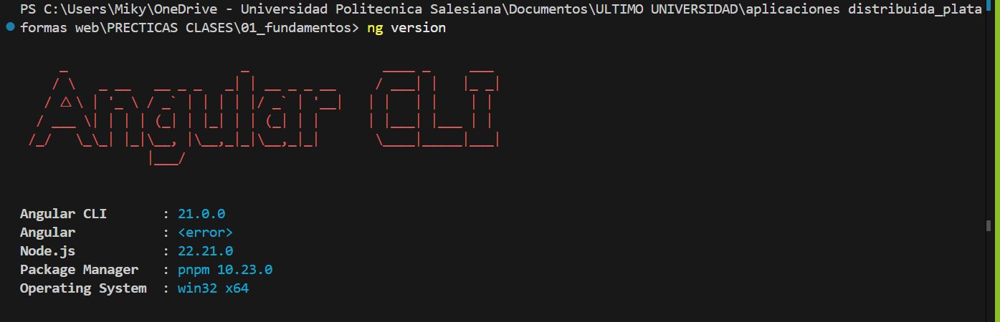
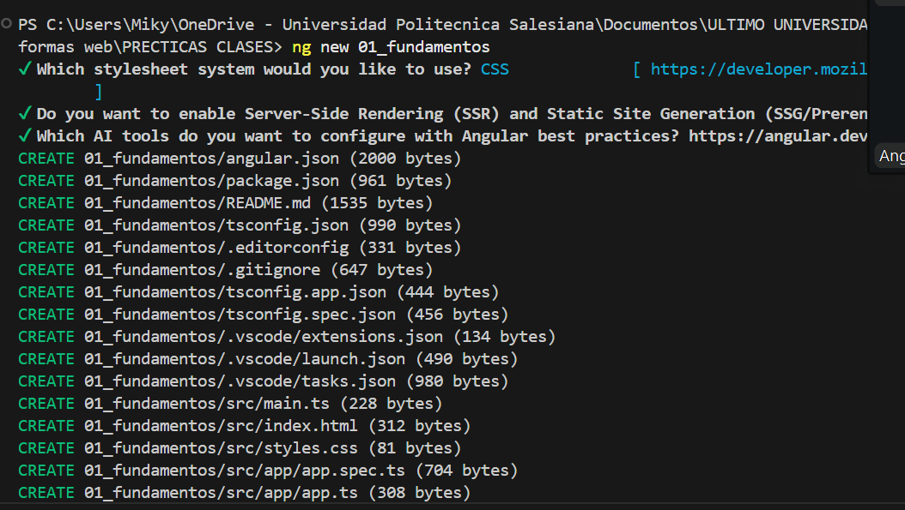
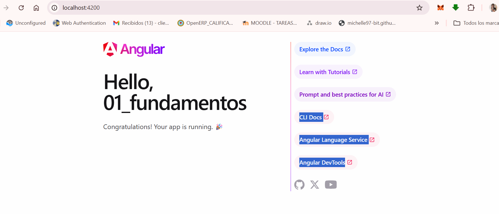
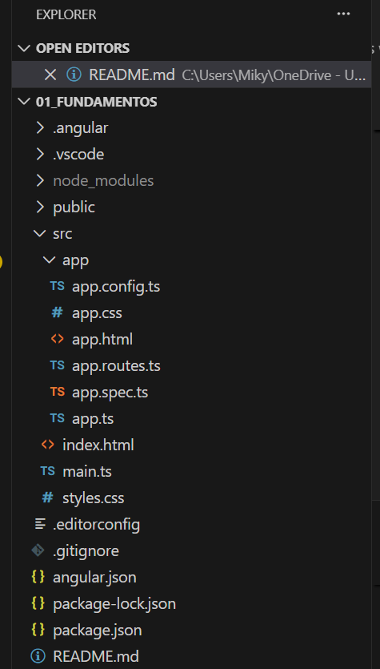

# 01Fundamentos

This project was generated using [Angular CLI](https://github.com/angular/angular-cli) version 20.3.8.

## Development server

To start a local development server, run:

```bash
ng serve
```

Once the server is running, open your browser and navigate to `http://localhost:4200/`. The application will automatically reload whenever you modify any of the source files.

## Code scaffolding

Angular CLI includes powerful code scaffolding tools. To generate a new component, run:

```bash
ng generate component component-name
```

For a complete list of available schematics (such as `components`, `directives`, or `pipes`), run:

```bash
ng generate --help
```

## Building

To build the project run:

```bash
ng build
```

This will compile your project and store the build artifacts in the `dist/` directory. By default, the production build optimizes your application for performance and speed.

## Running unit tests

To execute unit tests with the [Karma](https://karma-runner.github.io) test runner, use the following command:

```bash
ng test
```

## Running end-to-end tests

For end-to-end (e2e) testing, run:

```bash
ng e2e
```

Angular CLI does not come with an end-to-end testing framework by default. You can choose one that suits your needs.

## Additional Resources

For more information on using the Angular CLI, including detailed command references, visit the [Angular CLI Overview and Command Reference](https://angular.dev/tools/cli) page.


## Resultados:

Capturas de pantalla como evidencia del proceso de instalación y configuración de Angular, así como explicaciones detalladas de los componentes y formularios utilizados en la práctica.

### 1. Instalación de Angular CLI y creación del proyecto:


**Descripción de la imagen:**

En esta captura se muestra el proceso de instalación de Angular CLI versión 20.3.67 mediante el gestor de paquetes ppnpm (Node Package Manager). Los pasos realizados fueron:

- **Comando ejecutado:** `pnpm install -g @angular/cli@20.3.67`
  - El flag `-g` indica una instalación global, permitiendo usar Angular CLI desde cualquier ubicación del sistema.
  - Se especifica la versión exacta `@20.3.67` para garantizar compatibilidad y reproducibilidad del entorno.

- **Proceso de instalación:** Se observa la descarga de dependencias necesarias y la configuración del paquete en el sistema.

- **Verificación:** Una vez completada la instalación, se puede verificar ejecutando:
  ```bash
  ng version
  ```
  Este comando muestra la versión instalada de Angular CLI y las dependencias del proyecto.


### 2. Revision de configuracion de angular: 



<!-- uso comando ng version -->
**Descripción de la imagen:**
En esta captura se muestra la salida del comando `ng version`, que proporciona información detallada sobre la configuración del entorno Angular. 


```bash

Angular CLI: 21.0.0
Node: 22.21.0
Package Manager: pnpm 10.23.0
OS: win32 x64
```


### 3. Creación del proyecto Angular:


Se crea un nuevo proyecto Angular llamado `01-fundamentos` utilizando el comando `ng new 01_fundamentos`. y lo levantamos con `ng serve -o`

```bash
ng new 01_fundamentos

```

 Configuración inicial del proyecto:

* Escojer CSS como preprocesador de estilos.

* Escojemos que no use Server Side Rendering (SSR). 
* En la pregunta si queremos usar `zoneless` respondemos que si, ya que Angular recomienda usar `zoneless` para mejorar el rendimiento en aplicaciones modernas y trabaja con señales asincrónicas de manera más eficiente.




### 4. Proyecto corriendo en el navegador:



###  5. Explicación de la estructura del proyecto:




##### Carpetas y archivos principales:

- `public`: Contiene archivos estáticos accesibles públicamente.
- `src`: Carpeta que contiene el código fuente de la aplicación.
- `node_modules`: Carpeta que contiene las dependencias del proyecto.
- `pnpm-lock.yaml`: Archivo de bloqueo de versiones para pnpm.
- `angular.json`: Archivo de configuración de Angular.
- `package.json`: Archivo de configuración de npm.
- `tsconfig.json`: Archivo de configuración de TypeScript.
- `tsconfig.app.json`: Archivo de configuración de TypeScript para la aplicación.
- `tsconfig.spec.json`: Archivo de configuración de TypeScript para las pruebas.

### Carpeta de código SRC

Dentro de la carpeta `src`, encontramos las siguientes subcarpetas y archivos importantes:

- `app`: Contiene el código principal de la aplicación, incluyendo componentes, servicios y módulos.
- `index.html`: Archivo HTML principal de la aplicación.
- `main.ts`: Punto de entrada de la aplicación.
- `styles.css`: Archivo de estilos globales.

### Carpeta APP

Dentro de la carpeta `app`, encontramos la siguiente estructura de archivos:

- `app.config.ts`: Archivo de configuración de la aplicación.
- `app.css`: Archivo de estilos específicos de la aplicación.
- `app.html`: Archivo HTML principal de la aplicación.
- `app.routes.ts`: Archivo de definición de rutas de la aplicación.
- `app.spec.ts`: Archivo de pruebas unitarias de la aplicación.
- `app.ts`: Archivo principal de la aplicación.
